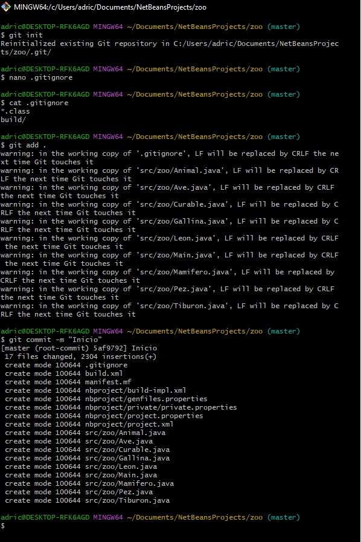
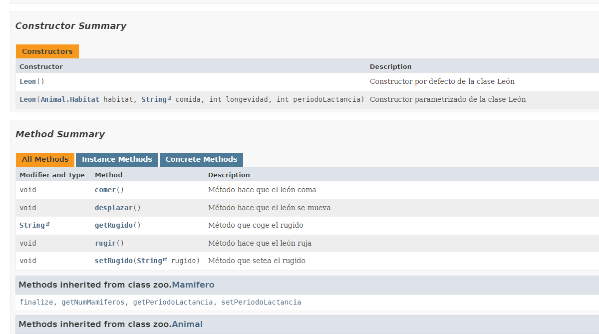
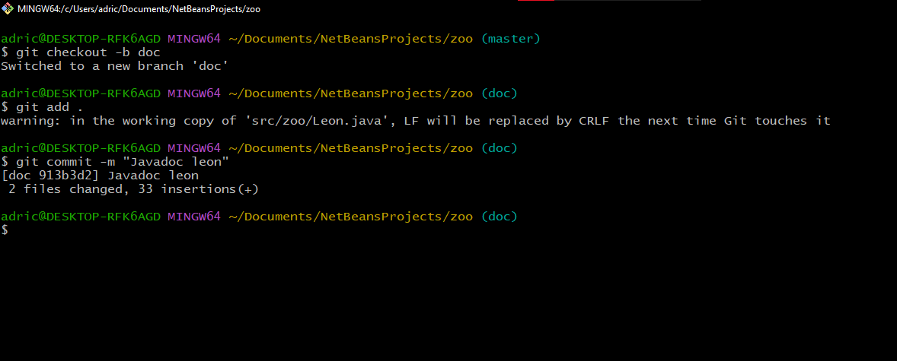
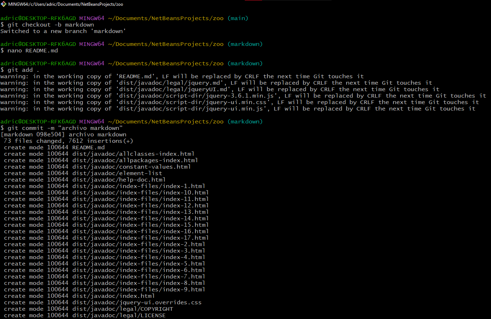

# RECUPERACION DE TEMA4 - ENTORNOS DE DESARROLLO #

**DOCUMENTACIÓN, OPTIMIZACIÓN Y CONTROL DE VERSIONES**

***ADRIÁN CABALLERO RUIZ***

## EJERCICIO 1 ##

## EJERCICIO 2 ##

## EJERCICIO 3 ##

## EJERCICIO 4 ##

## EJERCICIO 5 ##

## EJERCICIO 6 ##

## EJERCICIO 7 ##

